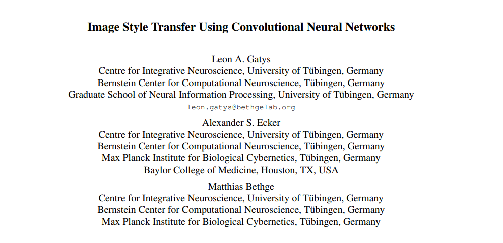
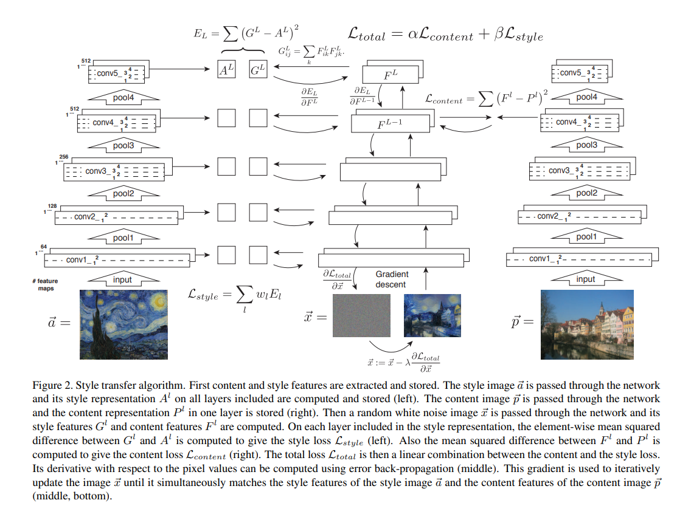

# Image Style Transfer Using Convolutional Neural Networks
  
  
스타일 트랜스퍼 논문 
## Contribution
content와 style을 분리해서 사용했으며, 기존 pretraned된 VGG19 모델을 사용했다는 것, 결과물이 이전 논문들 결과물 대비 매우 화질이 좋았다는 점 등이 있음   
Abstract에서 핵심 문장은 "A Neural Algorithm of Artistic Style that can seperate and recombine the image content and style of natural images". 컨텐츠와 스타일을 분리하고, 다시 조합하는 아키텍쳐를 정확하게 묘사함  

## StyleTransfer
    

## VGG19 네트워크
 br>  

## Method
#### Deep image representations
 
오브젝트 인식과 로컬라이제이션에 트레이닝된 VGG19 네트워크(19-layer VGG network)를 사용함, 16개 convolutional과 5개의 풀링 레이어. FC(Fully connected layer)는 사용하지 않음 
원 논문에서는 프레임워크로 카페를 썼다고 했으나, 현실적으로 구현은 파이썬, 그리고 pytorch, torchvision을 통해서 자주 이루어짐 
기존 프레임워크 안에 있는 VGG19 네트워크에서는 맥스 풀링을 쓰지만, average pooling이 좀 더 나은 결과를 보여주었음   

#### Content representation
수식에서 input image는 $\vec{x}$로 표시됨  
$N_l$은, 이미지의 가로길이 곱하기 세로 길이인 $M_l$의 각 feature map 
때문에 레이어 l(엘)의 행렬 $F^{l}$은 $N_l$ by $M_l$의 real-number matrix이다. $R^{N \times M}$ 
$F_{ij}$는 각 레이어의 포지션 j에 있는 i-th 필터의 액티베이션이다 
$\vec{p}$는 원본 컨텐츠 이미지, $\vec{x}$는 생성된 이미지를 말하고, 이 각 버전의 capital letter버전인 $P^{l}$과 $F^{l}$은 레이어l에서 각각의 feature representation 
그리고 content loss를 정의하는데, 이는 Mean Squared Error (MSE)로 나타낼 수 있음 
    

#### Style representation
feature correlation을 알기 위해서 Style loss에는 Gram matrix를 사용함 
  
Gram matrix는 자기 자신의 내적으로 vectorized feature maps i와 j의 내적(inner product)  
여러 레이어들간의 feature correlation을 포함함으로써(Gram matrix), input image에 대한 multi-scale representation을 얻을 수 있음 
이는 텍스텨 정보를 캡쳐하지만 global arrangement는 아님  
we can visualize the information captured by these style feature spaces built on different layers of the network by constructing an image that matches the style representation of a given input image. 
this is done by - original image의 Gram matrix와 generated image의 Gram matrix간의 mean-squared distance를, Gradient descent를 통해 줄여나감  

$\vec{a}$는 컨텐츠 오리지널 이미지, $\vec{x}$는 generated 이미지 
이 style loss도 MSE 
  

#TODO: activation layer같은 경우, content나 style이나 둘 다 ReLU로 되는건가??   

### StyleTransfer
style transfer 총 loss는 (alpha*content_loss) + (beta*style_loss)  
alpha, beta는 각각 weighting factor  

optimization으로는 L-BFGS를 사용하는게 가장 결과가 좋음    

## Results
기존 프레임워크에서 pretrained VGG19를 불러와서 쓴 레이어는  
content representation: conv4_2 
style representation: conv1_1, conv2_1, conv3_1, conv4_1, conv5_1  

그리고 w_{l}은 1/5를 conv5_1에서 사용하고, 나머지 레이어들은 전부 0을 사용 
alpha와 beta의 ratio는 1x10^{-3}, 8x10^{-4}, 5x10^{-3}, 5x10^{-4}   

초기 init image는 noise뿐만 아니라 content image나 style image로 주기도 했음 
